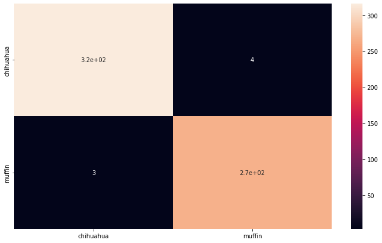

# **CAIS++ Winter Project**
## Pratyush Jaishanker
#### pjaishan@usc.edu

The project I chose was the binary image classification task - muffin vs chihuahua. In short, the task was to create a machine learning model that would correctly identify images of muffins and chihuahuas, which may look similar at first glance. Additionally, transfer learning on a pretrained model was a requirement for this task. 

## Dataset

- 5917 images scraped from Google Images, 3199 of chihuhuas and 2718 of muffins
- 80% in training set, 10% in test, and 10% in validation
- Data originally came in an 80%/20% train-test split, so I made a validation set by randomly separating the test set in two
- Because of the large number of images, data augmnetation was not required
- However, the images were different sizes so they were normalized to 224x224
- Additionally, the individual pixel color values were normalized by the mean and standard deviation of the color values for the entire dataset

## Model Development and Training

- The pretrained model I chose was ResNet18
- ResNet18 is the simplest model in the ResNet family, so it is the least computationally expenssive
- Additionally, ResNet was chosen over other image models because the dataset it was trained on, ImageNet, already contained a Chihuahua class
- I ran 10 epochs, with rounds of training and validation
- Because my model ran fairly well, I did not need to adjust the hyperparameters very much

## Model Evaluation/Results

- My training and validation losses were very low, and the training and validation accuracies were very high
- My best validation accuracy was 0.999577
- To visualize accuracy in the test set, I created a confusion matrix
- Only 3 chihuahuas were mistaken for muffins and only 4 muffins were mistaken for chihuahuas, out of the 592-image test set

## Discussion

- My dataset was very helpful because there were a lot of very varied images, so data augmentation was unnecessary
- ResNet18 was a very simple yet effective architecture
- My training procedures worked, but could be improved upon for a more complex task, such as lowering learning rate due to fluctuating validation losses in the middle
- Additionally, I did not need 10 epochs as my accuracy was already .9973 by the 6th epoch
- The confusion matrix was a simple way to represent model accuracy because there were only 2 classes, so the matrix only had 4 sections
- This task could be extended to classifying more classes, which may aid social good by helping people with limited vision distinguish similar objects
- However, this may require a more complex model architecture
- If I were to continue this project, I would create saliency maps to determine which areas of the image the model is using to classify, which may help us make our model run faster by cropping out useless areas

## References
 - Torchvision documentation - https://pytorch.org/vision/stable/index.html
 - Scikit Learn Confusion Matrix - https://scikit-learn.org/stable/modules/generated/sklearn.metrics.confusion_matrix.html
 - 
